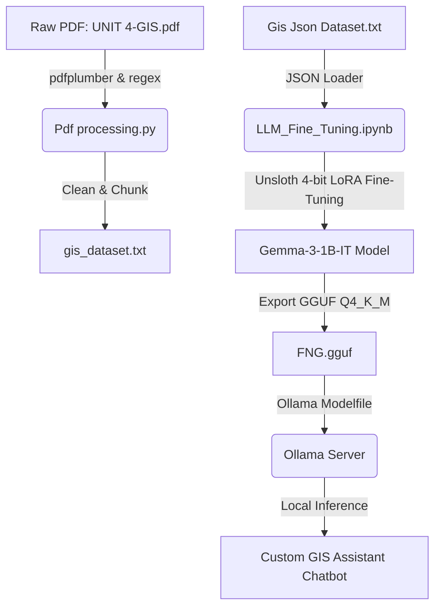

# 🌍 GIS-Assistant: Gemma-3 LLM Fine-Tuning & Ollama Deployment

A specialized Geographic Information System (GIS) assistant built by fine-tuning the **Gemma-3-1B-IT** model on curated GIS course materials and a structured Q&A dataset. This repository contains the complete end-to-end pipeline: PDF text extraction and processing, parameter-efficient LoRA fine-tuning using Unsloth, GGUF export, and local deployment via Ollama.

---

## 📂 Project Structure

*   [LLM_Fine_Tuning.ipynb](file:///c:/Posting/Fine%20Tuning/LLM_Fine_Tuning.ipynb): Jupyter notebook containing the full fine-tuning workflow using Unsloth, including model loading, training configuration, testing, and GGUF model conversion.
*   [Pdf processing.py](file:///c:/Posting/Fine%20Tuning/Pdf%20processing.py): A text extraction and preparation script that processes raw academic PDFs, removes artifacts/headers, and chunks the texts.
*   [Modelfile.txt](file:///c:/Posting/Fine%20Tuning/Modelfile.txt): Ollama configuration file containing custom system prompts, temperature settings, and stop-tokens for running the fine-tuned model locally.
*   [Gis Json Dataset.txt](file:///c:/Posting/Fine%20Tuning/Gis%20Json%20Dataset.txt): A structured JSON dataset containing 350+ curated GIS Q&A pairs (coordinate systems, data models, database structures, map projections, etc.) used for supervised fine-tuning.
*   [gis_dataset.txt](file:///c:/Posting/Fine%20Tuning/gis_dataset.txt): The unstructured corpus extracted and cleaned from the PDF documents, chunked into ~300-word blocks.
*   `FNG.gguf`: The final quantized (`Q4_K_M`) fine-tuned GGUF model binary ready to be imported into Ollama.

---

## 🛠️ Pipelines & Workflow



### 1. Data Processing Pipeline (`Pdf processing.py`)
This script automates the extraction and cleaning of study material from raw PDFs.
*   **Extraction**: Utilizes `pdfplumber` to retrieve text page-by-page.
*   **Cleaning**: Uses regular expressions to filter out headers, footers, page numbering, and app-specific download artifacts (e.g., `STUCOR APP`, `RMKCET - CSE DEPT`, `OCE552 - GEOGRAPHIC INFORMATION SYSTEM`).
*   **Chunking**: Chunks the text into segments of ~300 words separated by double-newlines, which makes it suitable for retrieval-augmented generation (RAG) or training corpuses.

### 2. Supervised Fine-Tuning (`LLM_Fine_Tuning.ipynb`)
The fine-tuning notebook is optimized to run on a Tesla T4 GPU (or equivalent) using the **Unsloth** framework to accelerate training:
*   **Base Model**: `unsloth/gemma-3-1b-it-unsloth-bnb-4bit` (4-bit quantized Gemma-3).
*   **Dataset Formulation**: Parses Q&A pairs from `Gis Json Dataset.txt` and formats them into a instruction template:
    ```text
    Q: <question>
    A: <answer><|endoftext|>
    ```
*   **PEFT/LoRA Adapters**: Applies low-rank adaptation using Unsloth's `FastLanguageModel.get_peft_model` with a rank `r=64`.
*   **Export**: Merges model weights back to 16-bit format, installs `llama.cpp` tools automatically, and outputs a highly optimized `Q4_K_M` GGUF model (`gemma-3-1b-it.Q4_K_M.gguf` -> renamed as `FNG.gguf`).

### 3. Ollama Local Deployment (`Modelfile.txt`)
Deploy the model locally using Ollama for lightweight, high-performance offline inference:
*   **Modelfile Config**: Configured to inherit from `./FNG.gguf`.
*   **Hyperparameters**: Top-p is set to `0.9` and Temperature to `0.7` to balance precision with creativity.
*   **System Prompt**: 
    > "You are a helpful AI assistant who gives short and simple answers."
*   **Stop Tokens**: `<|im_end|>` and `</s>` to prevent the model from generating repetitive or infinite outputs.

---

## 🚀 Getting Started

### 📋 Prerequisites
Install the required Python packages:
```bash
pip install pdfplumber torch torchvision unsloth trl peft accelerate bitsandbytes datasets
```

### 1. Preprocess the PDFs
Update the `pdf_path` inside [Pdf processing.py](file:///c:/Posting/Fine%20Tuning/Pdf%20processing.py) and execute it to extract cleaned text:
```bash
python "Pdf processing.py"
```

### 2. Fine-Tune & Export GGUF
Run [LLM_Fine_Tuning.ipynb](file:///c:/Posting/Fine%20Tuning/LLM_Fine_Tuning.ipynb) in your Jupyter environment.
*   The notebook will output the trained GGUF model files.
*   Rename or copy the generated GGUF file to `./FNG.gguf` in this project directory.

### 3. Run Locally with Ollama
Make sure Ollama is installed on your system. Run the following commands to build and start the model:

```powershell
# Create the custom model using the Modelfile config
ollama create gis-assistant -f ./Modelfile.txt

# Start chatting with your fine-tuned GIS assistant
ollama run gis-assistant
```

---

## 📊 Dataset Preview
A snapshot of Q&A topics covered in the training dataset (`Gis Json Dataset.txt`):
*   **Geographic Coordinate Systems**: Longitude, latitude, ellipsoids, datums (WGS-84, OSGB-36).
*   **Map Projections**: Conformal, equal-area, equidistant, azimuthal, Web Mercator, scale factors, false easting/northing.
*   **Database Models**: Relational structures, ER Diagrams, object-oriented/georelational data models, SQL querying limits.
*   **Spatial Data structures**: Vectors vs. Rasters, TIN (Triangulated Irregular Network), GRID, topology concepts (connectivity, contiguity, area definition).
*   **Raster Compression**: Lossless (RLE, LZW, Block Coding, Quadtree) vs. Lossy (wavelets like MrSID, ECW).
*   **GIS Standards & Quality**: OGC standards, GML (Geography Markup Language), SDI (Spatial Data Infrastructure), positional/attribute accuracy.
